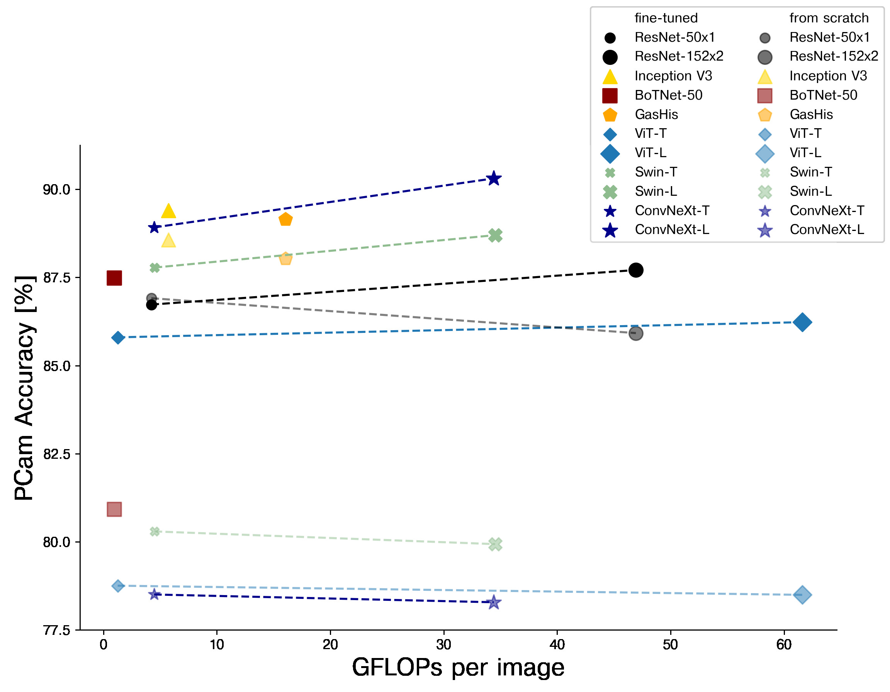
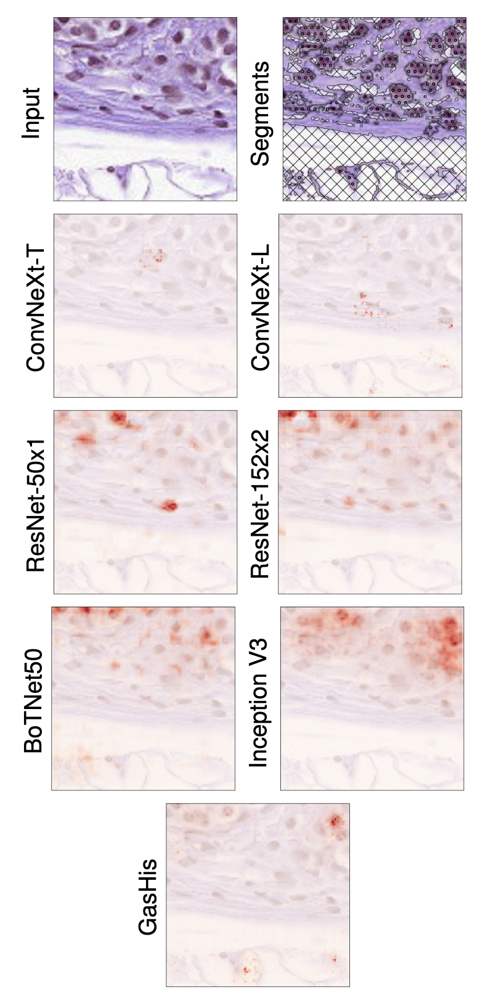
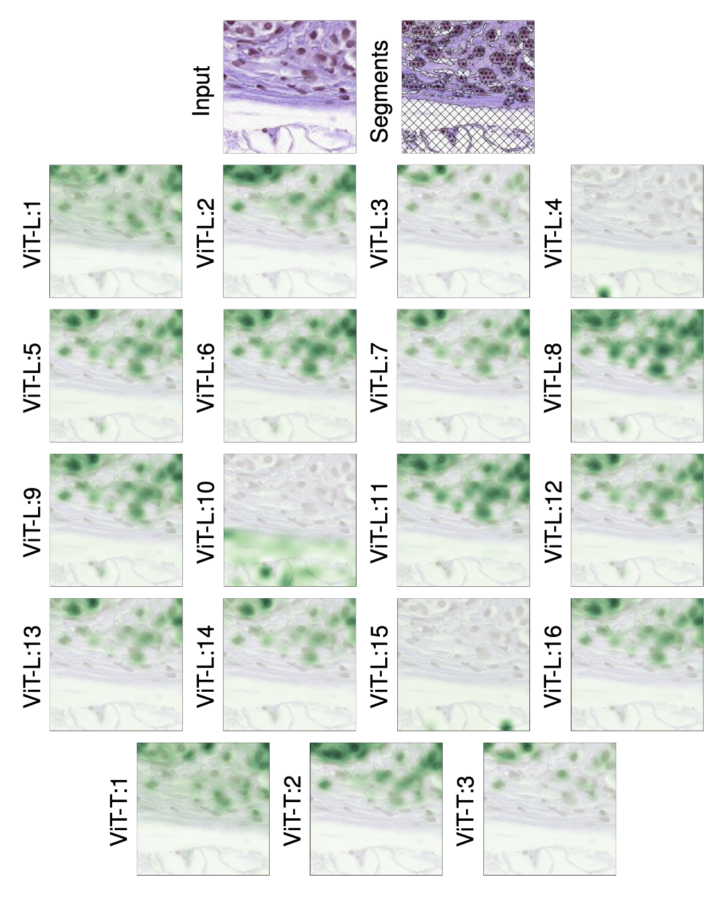
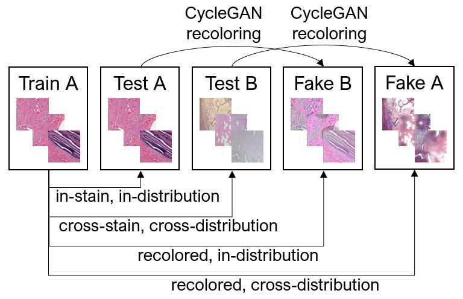

# From modern CNNs to vision transformers: Assessing the performance, robustness, and classification strategies of deep learning models in histopathology

While machine learning is currently transforming the field of histopathology, the domain lacks a comprehensive evaluation of state-of-the-art models based on essential but complementary quality requirements beyond a mere classification accuracy. In order to fill this gap, we developed a new methodology to extensively evaluate a wide range of classification models, including recent vision transformers, and convolutional neural networks such as: ConvNeXt, ResNet (BiT), Inception, ViT and Swin transformer, with and without supervised or self-supervised pretraining. We thoroughly tested the models on five widely used histopathology datasets containing whole slide images of breast, gastric, and colorectal cancer and developed a novel approach using an image-to-image translation model to assess the robustness of a cancer classification model against stain variations. Further, we extended existing interpretability methods to previously unstudied models and systematically reveal insights of the models’ classification strategies that allow for plausibility checks and systematic comparisons. The study resulted in specific model recommendations for practitioners as well as putting forward a general methodology to quantify a model’s quality according to complementary requirements that can be transferred to future model architectures.


Our paper can be found at [MEDIMA](https://www.sciencedirect.com/science/article/abs/pii/S1361841523000701) and on [arXiv](https://arxiv.org/abs/2204.05044). 
Please cite our work, when using this code:
```
@article{SPRINGENBERG2023102809,
    title = {From modern CNNs to vision transformers: Assessing the performance, robustness, and classification strategies of deep learning models in histopathology},
    journal = {Medical Image Analysis},
    pages = {102809},
    year = {2023},
    issn = {1361-8415},
    doi = {https://doi.org/10.1016/j.media.2023.102809},
    url = {https://www.sciencedirect.com/science/article/pii/S1361841523000701},
    author = {Maximilian Springenberg and Annika Frommholz and Markus Wenzel and Eva Weicken and Jackie Ma and Nils Strodthoff},
    keywords = {Interpretability, Histopathology, Machine learning, Robustness}
}
```

# Table of Contents

- [Quantitative Evaluation](#quantitative-evaluation)
    - [Training a Model](#training-a-model)
    - [Evaluation of Models](#evaluation-of-models)
- [Interpretability Evaluation](#interpretability-evaluation)
    - [Training a Segmentation Model](#training-a-segmentation-model)
    - [Generating Relevance Maps and Calculating Scores](#generating-relevance-maps-and-calculating-scores)
- [Robustness Evaluation](#robustness-evaluation)
    - [Training a Cycle GAN](#training-a-cycle-gan)
    - [Generating the Re-Stained Test-Sequence](#generating-the-re-stained-test-sequence)
- [Remarks on Dataset Folds](#remarks-on-dataset-folds)
- [Citations](#citations)


## Quantitative Evaluation

<p align="center"></p>

### Training a Model

The `main_patho_lightning.py` script handles the training of all models.

You could for example train a ResNet50 model using:
```
python3 main_patho_lightning.py /path/to/PCam --dataset=PCam --epochs=20 --batch-size=128 --arch=resnet50 --gpus=1 --k_experiments=1 --refresh-rate=1 --num-classes=2 --no-concat-pooling --output-path /path/to/output
```

or an Inception V3 using:
```
python3 main_patho_lightning.py /path/to/PCam --dataset=PCam --epochs=20 --batch-size=64 --arch=inception_v3 --gpus=1 --k_experiments=1 --refresh-rate=1 --num-classes=2  --output_path /path/to/output
```

### Evaluation of Models

Firstly, we collect the models metric scores and bootstrap results.
```
python3 main_cls_scores.py /media/data/PCAM  --dataset=PCam --num-classes=2 --output-path /path/to/score_output_ResNet50 --refresh-rate=1 --batch-size=128 --arch=resnet50 --no-concat-pooling --gpus=1 --k_experiments=1 --pretrained /path/to/model_out/models/experiment_xyz.pth
```

Then, we compute mean and standard deviation, optionally checking for statistically significantly worse performance.

```
python3 main_score_stats.py /path/to/score_output_ResNet50 --pth_model_logs_B=/path/to/score_output_InceptionV3
```

## Interpretability Evaluation

<p align="center"></p>
<p align="center"></p>

We provide code for both LRP and attention evaluation based on a segmentation of nuclei, tissue and background areas.
Exemplary results are displayed above.


### Training a Segmentation Model

We used the [Monuseg](https://monuseg.grand-challenge.org/) dataset to train our segmentation model.

Firstly, you'll have to extract and store patches for patched MoNuSeg, that have similar magnification to PCam, e.g., by using the script:

```
python3 gen_custom_mag.py path/to/MoNuSegTrainingData  /path/to/PatchedMoNuSeg/MoNuSegTrainingData --old-mag=40 --new-mag=400
```

Then, you can train a [nnUNet](https://github.com/MIC-DKFZ/nnUNet) on those patches, e.g.:
```
python3 main_segmentation.py /path/to/PatchedMoNuSeg/ --dataset=PMoNuSeg --output-path=/media/data/out/unet/PMoNuSeg_trained --refresh-rate=1 --epochs=200 --batch-size=64 --arch=unet --gpus=1 --dset-stretch-factor=10 --augment --img-shape 96 96
```

### Generating Relevance Maps and Calculating Scores

For the relevance evaluation, you'll have to run:

```
python3 main_heatmaps.py PCAM --dataset=PCAM --output-path /path/to/output --arch=resnet50 --gpus=1 --batch-size=32 --xai-method=LRP --model-nuclei /path/to/unet --seg-size 96 96 --cls-idx=1 --cls-objective=1
```

You can evaluate the attention maps by setting `--xai-method=Attention`.


## Robustness Evaluation

<p align="center"></p>

The robustness evaluation procedure can be summarized as the disentanglement of the effect of color and distribution biases on performance.
A visualization of the procedure is displayed above.

### Training a Cycle GAN

You can train a cycle GAN on the test sets that you want to evaluate robustness on

```
python3 cgan_training.py /path/to/imgsA /path/to/imgsB /path/to/output_A2B --batch-size=64 --epochs=150 
```

### Generating the Re-Stained Test-Sequence

You can generate re-stained samples
```
python3 cycle_gan.py <DSET_NAME> /path/to/datasetA /path/to/output_A2B --output_dir /path/to/restained_datasetA

python3 cycle_gan.py <DSET_NAME> /path/to/datasetB /path/to/output_A2B --output_dir /path/to/restained_datasetB --model_B
```

The resulting dataset can be loaded and evaluated when setting `--dataset=Robust` in the evaluation.


## Remarks on Dataset Folds

The BreaKHis splits used in our work are stored in `BreaKHis_x40_folds.json`. Make sure to place this JSON file in

```
/path/to/BreakHis/data/BreaKHis_v1/histology_slides/breast/
```
for the provided dataloaders to load the correct splits.


## Citations

Other than our paper (see citation above), we urge you to cite the following works.

We utilized the LRP framework provided by [Interpreting Deep Neural Networks - Relative Attributing Propagation](https://github.com/wjNam/Relative_Attributing_Propagation) and [PyTorch Implementation of Transformer Interpretability Beyond Attention Visualization](https://github.com/hila-chefer/Transformer-Explainability).
When using this code, please cite:

```
@misc{nam2019relative,
    title         = {Relative Attributing Propagation: Interpreting the Comparative Contributions of Individual Units in Deep Neural Networks},
    author        = {Woo-Jeoung Nam and Shir Gur and Jaesik Choi and Lior Wolf and Seong-Whan Lee},
    year          = {2019},
    eprint        = {1904.00605},
    archivePrefix = {arXiv},
    primaryClass  = {cs.CV}
}
@InProceedings{Chefer_2021_CVPR,
    author    = {Chefer, Hila and Gur, Shir and Wolf, Lior},
    title     = {Transformer Interpretability Beyond Attention Visualization},
    booktitle = {Proceedings of the IEEE/CVF Conference on Computer Vision and Pattern Recognition (CVPR)},
    month     = {June},
    year      = {2021},
    pages     = {782-791}
}
@misc{rw2019timm,
  author = {Ross Wightman},
  title = {PyTorch Image Models},
  year = {2019},
  publisher = {GitHub},
  journal = {GitHub repository},
  doi = {10.5281/zenodo.4414861},
  howpublished = {\url{https://github.com/rwightman/pytorch-image-models}}
}
```

Also, please consider citing the [nnUNet](https://github.com/MIC-DKFZ/nnUNet):

```
Isensee, F., Jaeger, P. F., Kohl, S. A., Petersen, J., & Maier-Hein, K. H. (2020). nnU-Net: a self-configuring method 
for deep learning-based biomedical image segmentation. Nature Methods, 1-9.
```

